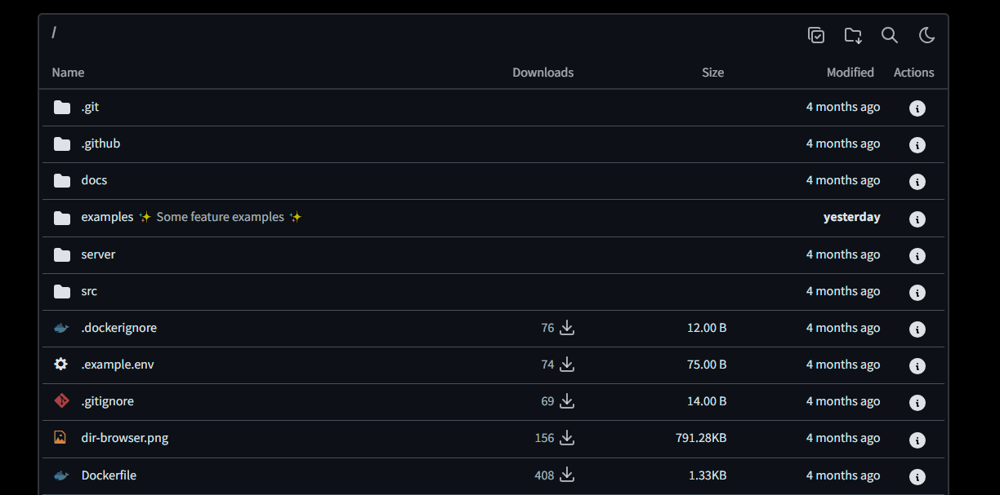

# Directory Browser

Directory Browser is a web application that allows users to browse their files and folders with ease. It provides a range of features to enhance the user experience while ensuring security and efficiency.

## Features

- **Download Counter**: Track how many times each file has been downloaded.
- **Secure by Default**: Provides read-only access to users for enhanced security.
- **Fast File Serving**: Utilizes NGINX for extremely fast file serving.
- **Markdown Rendering Support**: Supports rendering of README markdown files.
- **JSON API**: Offers a JSON API for programmatic access to your files.
- **Batch Downloads**: Download files and folders in a zip archive.
- **File Integrity Check**: Ensures file integrity using hashes.
- **Custom Descriptions and Labels**: Add custom descriptions and labels for your files and folders.
- **Search and Sorting**: Built-in search and sorting functionalities.
- **Password Protection**: Secure your files and folders with password protection.
- **Hide Files and Folders**: Ability to hide specific files and folders from view.
- **Light and Dark Mode**: Switch between light and dark themes for better accessibility.
- **File Icons**: Visual differentiation of files with icons.
- **Multiple Themes**: Choose from various themes to customize your experience.
- **Clean URLs**: URLs are structured like file system paths for better readability.
- **Low Memory Footprint**: The application runs efficiently with a low memory footprint (~10MB).
- **Easy Setup**: Set up with a single Docker image for quick deployment.
- **Responsive Design**: Designed to work seamlessly on both mobile devices and desktops.
- **Environment Variable Configuration**: Easily configurable using environment variables.
- **File Statistics**: Displays modification dates and sizes for each file.

## Getting Started

To run the Directory Browser, you will need Docker installed on your system. Follow the steps below to set it up.

### Prerequisites

- [Docker](https://docs.docker.com/get-docker/) installed on your machine.

### Running the Application

1. **Clone the repository**:

   ```bash
   git clone <repository-url>
   cd <repository-directory>

2. **Build and run the Docker container** :
   ```bash
   docker build -t directory-browser .
   docker run -d -p 8080:8080 --name directory-browser directory-browser

Example : 



